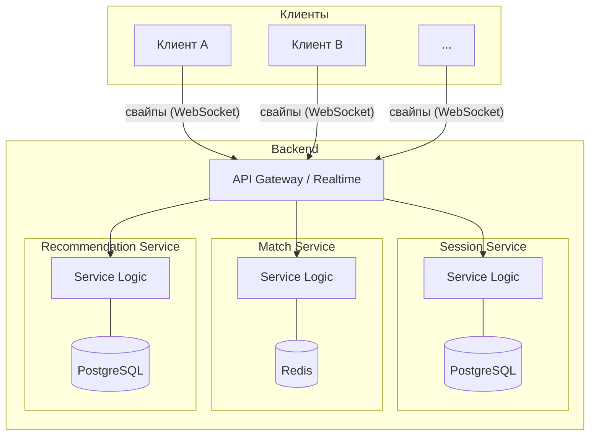
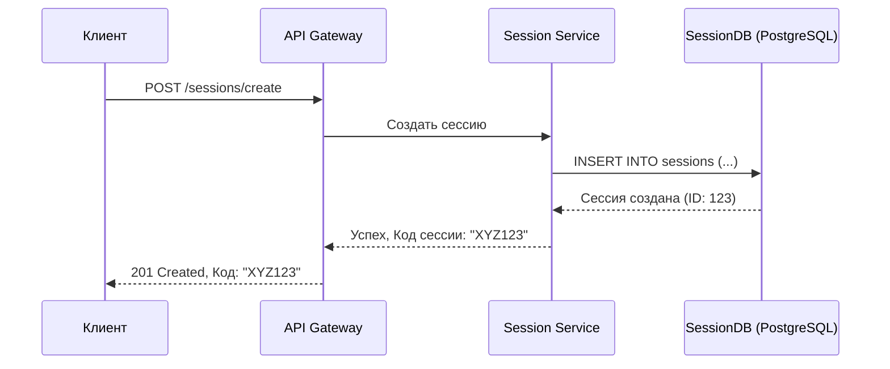
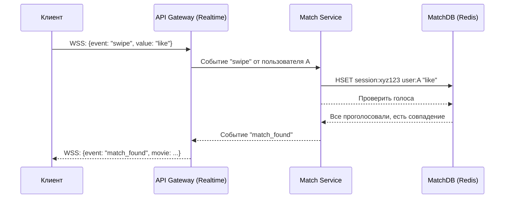
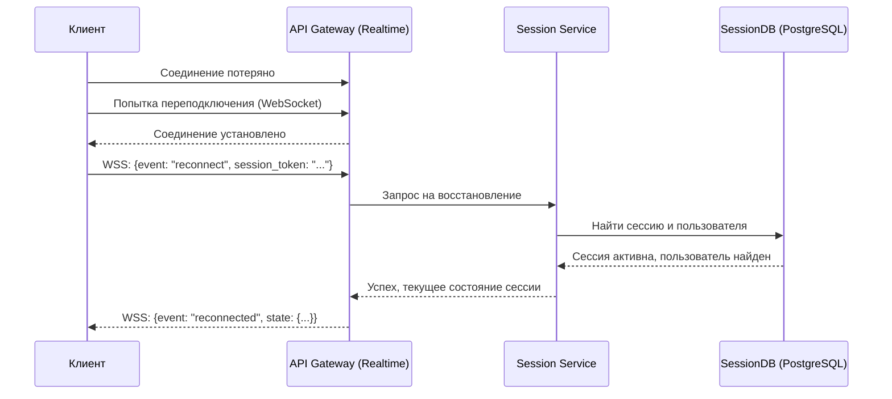

# Техническое решение проекта «FlickToPick»

## Введение
- **Цель проекта:**  
  Система решает проблему оптимального и быстрого выбора фильма для совместного/личного просмотра

- **Основания для разработки:**  
  Учебный проект по курсу «Распределенные системы», удобное и полезное, востребованное приложение для потребителей  

- **Команда:**  
  * Шпетный Сергей Русланович - разработчик\
  * Бублик Илья Олегович - разработчик\
  * Пластинин Дмитрий Александрович - разработчик\
  * Номоконова Анна Александровна - тестировщик, аналитик

---

## Глоссарий
| Термин        | Определение |
|---------------|-------------|
| Аватар  | графическое изображение пользователя в интерфейсе приложения |
| Анонимное голосование | режим сессии, при котором участники не видят, кто как проголосовал за фильм. Результаты (лайк/дизлайк) видны всем, но не привязаны к конкретным аватарам |
| Восстановление сессии | функционал, позволяющий возобновить прерванную сессию |
| Голосование | процесс выражения пользователем отношения к фильму с помощью свайпов (вверх/вниз). Синхронизируется между всеми участниками сессии |
| Дублирующиеся фильмы | фильмы, которые уже были показаны в текущей сессии или находятся в списках "Просмотрено" или "Не нравится" участников. Исключаются из подборки |
| Карточка фильма | основной элемент интерфейса, содержащий информацию о фильме: постер, название, жанр, рейтинг, описание |
| Код сессии | уникальный идентификатор (обычно комбинация букв и/или цифр), который создатель сессии передает другим пользователям для подключения |
| Подборка | набор фильмов, предлагаемый пользователям в рамках одной сессии. Формируется на основе предпочтений участников | 
| Участник сессии | человек, принимающий участие в сессии |
| Посмотреть позже |  список, в который можно сохранить фильм, если совпадение найдено, но смотреть его планируется позднее |
| Просмотрено | список фильмов, которые пользователь уже видел. Такие фильмы автоматически исключаются из показа в сессии |
| Сессия | сеанс совместного выбора фильма, в котором участвуют два или более пользователя. Все действия в сессии синхронизированы |
| Свайп |  жест пользователя по экрану для выражения реакции на фильм |
| Совпадение (Матч) | результат, при котором все участники сессии проголосовали "нравится" за один и тот же фильм |
| Таймаут бездействия |  период времени (3 секунды), по истечении которого автоматически запускается трейлер фильма |
| Трейлер | короткий видеоролик о фильме. Запускается автоматически при бездействии пользователя |

---

## Функциональные требования
Система должна предоставлять следующие функции:
1. Создание групп пользователей
1. Добавление гостей в группы по ссылке
1. Добавление фильмов в пулл "Хочу посмотреть сейчас" свайпом влево
1. Добавление фильмов в пулл "Не хочу смотреть" свайпом вправо
1. Добавление фильмов в пулл "Хочу посмотреть позже" свайпом вниз
1. Открытие дополнительной информации о фильме свайпом вверх
1. Отображение фильма для общего просмотра, как первого, попавшего в пулл "Хочу посмотреть сейчас" у каждого пользователя
1. Настройка выборки предлагаемых фильмов по критериям

---

## Нефункциональные требования
1. Любые действия пользователя должны отображаться на его экране мгновенно, меньше 100 мс
2. В условиях не стабильного интернета система должна гарантировать, что после его восстановления его сессия будет восстановлена 
3. Если все пользователи выберут какой- то фильм система должна корректно отработать и уведомить всех пользователей о находке «победителя»
4. Все голоса всех участников в рамках одной сессии должны быть сохранены и не потеряны до окончания выбора фильма
5. Архитектура должна позволять одновременно работать множеству независимых групп
6. Отказ одного серверного компонента не должен приводить к полной недоступности приложения для всех групп
7. Только участники присоединившиеся к сессии (получившие ссылку или код)могут влиять на выбор фильм
8. Распределения трафика сессий.

---

## Пользовательские сценарии
Основной сценарий:

1. Создание сессии выбора фильма.
* Пользователь А открывает приложение FlickToPick.
* Пользователь А выбирает опцию "Создать сессию".
* Приложение генерирует уникальный код приглашения для сессии и отображает его.
* Пользователь А делится этим кодом с друзьями.
____________________________________
2. Подключение к сессии.
* Пользователи B, C, D запускают приложение FlickToPick.
* Они выбирают опцию "Присоединиться к сессии" и вводят полученный код приглашения.
* Приложение подключает их к сессии, созданной пользователем А.
____________________________________
3. Выбор фильма.
* На всех устройствах появляется карточка с информацией о первом фильме: постер, жанр, рейтинг, продолжительность и краткое описание.
* Пользователи видят две опции свайпа:
* Свайп влево — "Нравится"
* Свайп вправо — "Не нравится"
* Свайп вниз — "Смотреть позже"
* Свайп вверх — "Трейлер" 
____________________________________
4. Свайпы и трейлеры.
* Каждый пользователь делает свайп 
* Все свайпы отправляются на сервер, который обрабатывает результат.
____________________________________
5. Результат выбора.
* Если все пользователи свайпнули "Нравится", появляется уведомление: "Совпадение найдено!" и предлагается выбрать:
  * перейти к просмотру фильма,
  * или сохранить фильм в список "Посмотреть позже".
* Если хотя бы один пользователь свайпнул "Не нравится", фильм отклоняется:
  * Фильм сохраняется в список "Не нравится" (не будет показываться снова).
* Если кто-то из участников уже смотрел этот фильм, он сохраняется в список "Уже просмотренные".
____________________________________
6. Продолжение выбора
* После выбора или отклонения фильм автоматически сменяется на следующий из подборки, учитывающей предпочтения всех участников.
* Процесс повторяется с шага 3 — просмотр карточки и свайпы.
* Пользователи продолжают выбирать фильмы, пока не найдут фильм, который понравится всем.
____________________________________
7. Завершение сессии
* После успешного выбора фильма участники могут завершить сессию или продолжить просмотр фильмов для выбора следующего.

---

## Архитектура системы

**Рисунок 1 - Высокоуровневая архитектура системы**

Клиенты взаимодействуют с системой через **API Gateway**, который также управляет WebSocket-соединениями для обмена событиями в реальном времени (свайпы, статусы). Шлюз маршрутизирует запросы к соответствующим микросервисам.

Каждый микросервис инкапсулирует свою бизнес-логику и имеет собственную, независимую базу данных, что соответствует подходу **Database per Service**:
- **Session Service**: Управляет жизненным циклом сессий (создание, подключение, завершение) и хранит их состояние в своей базе данных **PostgreSQL**.
- **Match Service**: Обрабатывает логику совпадений голосов. Использует **Redis** для быстрого доступа и обработки временных данных голосования.
- **Recommendation Service**: Отвечает за формирование подборки фильмов на основе предпочтений пользователей, используя собственную базу данных **PostgreSQL** для хранения информации о фильмах и пользовательских предпочтениях.

---

## Технические сценарии

### Сценарий: Создание сессии

1. Клиент отправляет запрос на создание новой сессии в API Gateway.
2. API Gateway маршрутизирует запрос в **Session Service**.
3. **Session Service** генерирует уникальный код сессии, создает запись о новой сессии и сохраняет ее в **SessionDB (PostgreSQL)**.
4. **Session Service** возвращает успешный ответ с кодом сессии в API Gateway.
5. API Gateway передает код сессии клиенту.

### Сценарий: Отправка свайпа и обработка голосов

1. Клиент отправляет событие свайпа (например, "like") через WebSocket-соединение в API Gateway.
2. API Gateway передает событие в **Match Service**.
3. **Match Service** сохраняет голос пользователя в **MatchDB (Redis)**, привязывая его к сессии и текущему фильму.
4. **Match Service** проверяет, все ли участники сессии проголосовали.
5. Если голоса собраны, **Match Service** анализирует результат. Если все проголосовали "like", он регистрирует совпадение (матч).
6. **Match Service** отправляет событие результата (`match_found` или `next_movie`) в API Gateway.
7. API Gateway рассылает это событие всем клиентам в сессии через WebSocket. В случае `next_movie` он также запрашивает следующий фильм у **Recommendation Service**.

### Сценарий: Восстановление сессии

1. Клиент, потерявший соединение, автоматически пытается переподключиться к WebSocket.
2. При успешном переподключении клиент отправляет событие `reconnect` с токеном сессии в API Gateway.
3. API Gateway направляет запрос на переподключение в **Session Service**.
4. **Session Service** проверяет валидность сессии и статус пользователя в **SessionDB**.
5. Если сессия активна, **Session Service** восстанавливает пользователя в сессии и возвращает ему актуальное состояние (например, текущий фильм и результаты голосования).
6. **Session Service** уведомляет API Gateway об успешном восстановлении.
7. API Gateway отправляет подтверждение и актуальное состояние сессии клиенту.

---

## План разработки и тестирования

### Основной проект (MVP)
**Включает:**
- Реализация базовых сервисов: Session, Match, Recommendation.
- Создание и подключение к сессии по коду.
- Реализация процесса голосования (свайпы) и синхронизация между участниками через WebSocket.
- Определение совпадения (мэтча), когда все участники голосуют "за".
- Базовый frontend для отображения карточек фильмов и взаимодействия с пользователем.

**План разработки:**
1. Проектирование API для сервисов и WebSocket-событий.
2. Реализация API Gateway для маршрутизации запросов.
3. Реализация **Session Service** (создание сессии, подключение участников).
4. Реализация **Match Service** (обработка голосов, логика совпадений).
5. Реализация **Recommendation Service** (предоставление базовой подборки фильмов).
6. Интеграция с базами данных (PostgreSQL для сессий и фильмов, Redis для голосов).
7. Разработка frontend: экраны создания/подключения к сессии, экран голосования.
8. Реализация WebSocket-клиента на frontend для отправки свайпов и получения обновлений.

**План тестирования:**
- Модульные тесты для бизнес-логики каждого сервиса (Session, Match).
- Интеграционные тесты для проверки взаимодействия сервисов через API Gateway.
- E2E-тесты основного сценария: создание сессии -> подключение нескольких пользователей -> голосование -> получение матча.
- Тесты WebSocket-соединения: отправка и получение событий в реальном времени.
- Проверка корректной смены фильма после голосования.

**Definition of Done (DoD) для MVP:**
- Пользователь может создать сессию и поделиться кодом.
- Другие пользователи могут подключиться к сессии по коду.
- Все участники видят одинаковые карточки фильмов и могут голосовать.
- Система корректно определяет "мэтч" и уведомляет всех участников.
- Основные компоненты backend и frontend реализованы и интегрированы.

### Расширенный проект (Advanced Scope)
**Включает:**
- Реализация гостевой авторизации и восстановления сессии.
- Добавление списков "Просмотрено" и "Посмотреть позже".
- Улучшение подборки фильмов на основе предпочтений.
- Повышение отказоустойчивости и производительности системы.
- Внедрение CI/CD для автоматизации сборки и развертывания.

**План разработки:**
1. Реализация **Auth Service** для управления гостевыми пользователями (JWT).
2. Доработка **Session Service** для поддержки восстановления прерванных сессий.
3. Реализация локального хранилища на клиенте для списков "Просмотрено" и "Посмотреть позже".
4. Улучшение алгоритмов **Recommendation Service** для учета пользовательских предпочтений.
5. Настройка CI/CD pipeline (например, с помощью GitHub Actions).
6. Контейнеризация приложения с помощью Docker для упрощения развертывания.
7. Добавление расширенных функций в API Gateway (логирование, rate limiting).

**План тестирования:**
- Тесты на восстановление сессии после разрыва соединения.
- Тесты на корректную работу списков "Просмотрено" и "Посмотреть позже".
- Нагрузочное тестирование для оценки производительности и масштабируемости.
- Тесты отказоустойчивости (имитация падения одного из сервисов).
- Тестирование авторизации и безопасности.

**Definition of Done (DoD) для расширенного проекта:**
- Реализован функционал восстановления сессии.
- Пользователи могут управлять персональными списками фильмов.
- Настроен и работает CI/CD pipeline.
- Приложение разворачивается в Docker-контейнерах.
- Проведено нагрузочное тестирование и оптимизация производительности.
