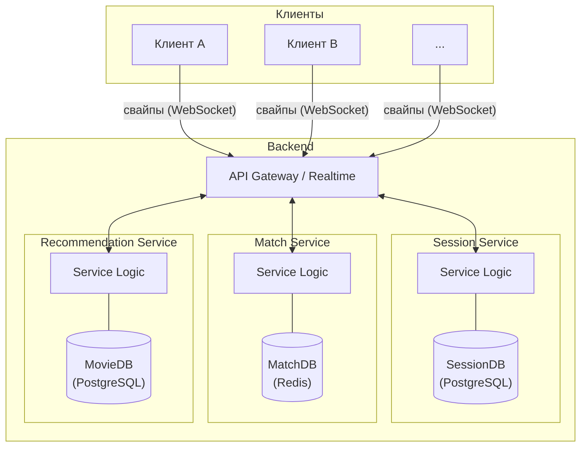
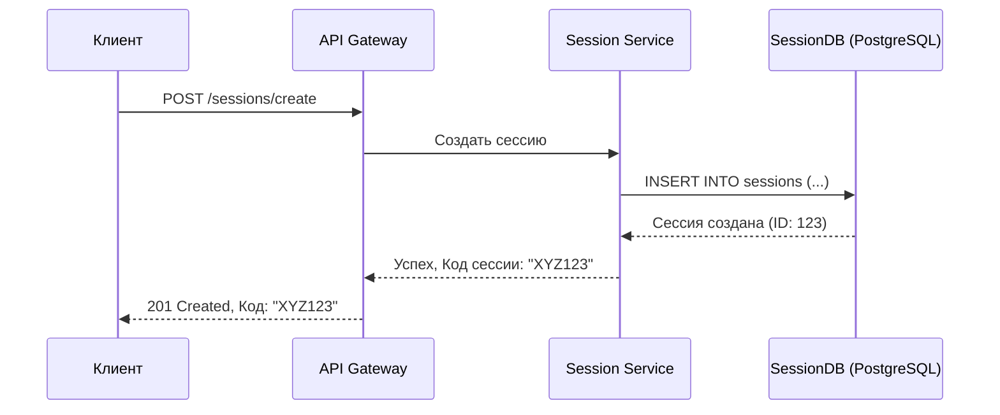
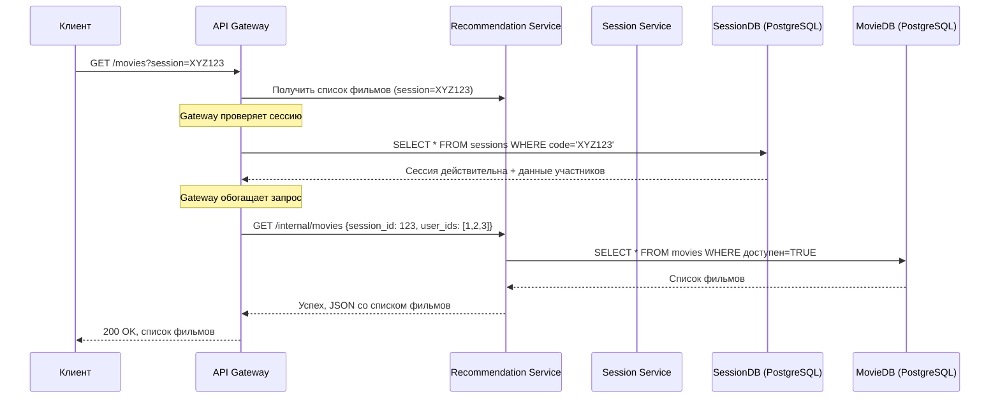
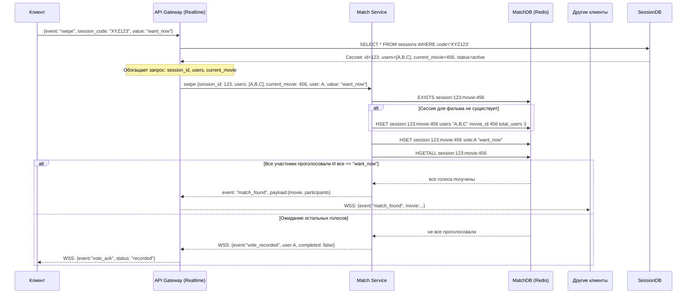
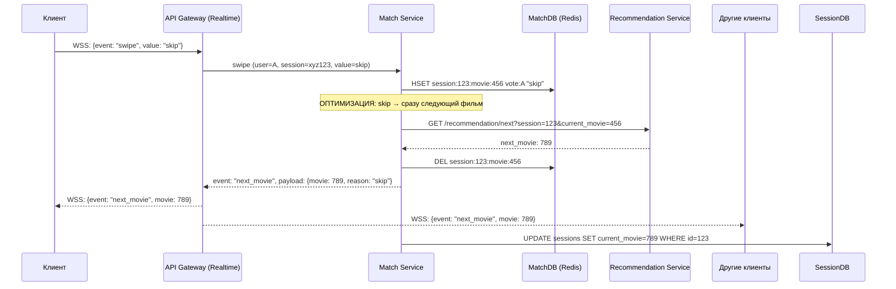
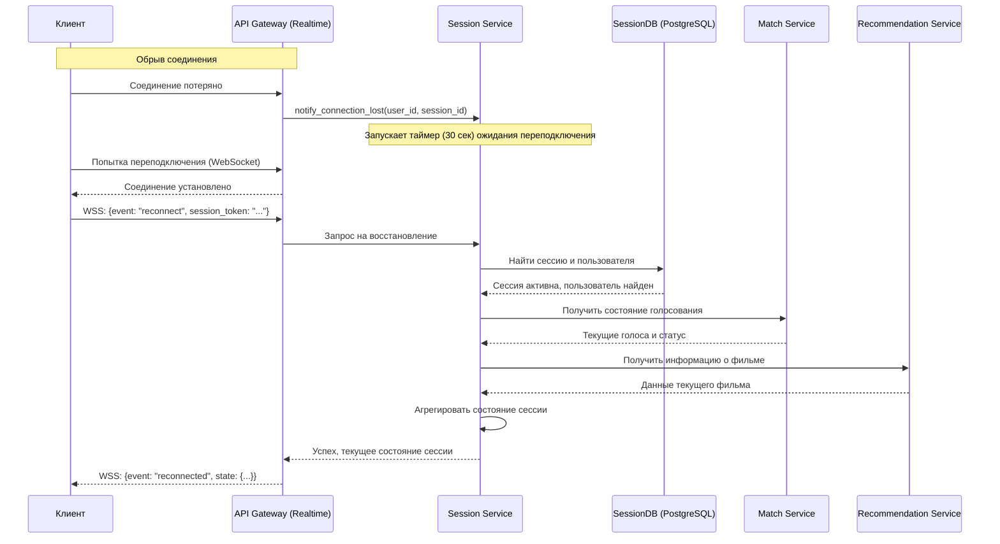

# Техническое решение проекта «FlickToPick»

## Введение
- **Цель проекта:**  
  Система решает проблему оптимального и быстрого выбора фильма для совместного/личного просмотра

- **Основания для разработки:**  
  Учебный проект по курсу «Распределенные системы», удобное и полезное, востребованное приложение для потребителей  

- **Команда:**  
  * Шпетный Сергей Русланович - разработчик\
  * Бублик Илья Олегович - разработчик\
  * Пластинин Дмитрий Александрович - разработчик\
  * Номоконова Анна Александровна - тестировщик, аналитик

---

## Глоссарий
| Термин        | Определение |
|---------------|-------------|
| Анонимное голосование | режим сессии, при котором участники не видят, кто как проголосовал за фильм. Результаты (лайк/дизлайк) видны всем, но не привязаны к конкретным аватарам |
| Восстановление сессии | функционал, позволяющий возобновить прерванную сессию |
| Голосование | процесс выражения пользователем отношения к фильму с помощью свайпов (вверх/вниз). Синхронизируется между всеми участниками сессии |
| Карточка фильма | основной элемент интерфейса, содержащий информацию о фильме: название, жанр, продолжительность |
| Код сессии | уникальный идентификатор (обычно комбинация букв и/или цифр), который создатель сессии передает другим пользователям для подключения |
| Подборка | набор фильмов, предлагаемый пользователям в рамках одной сессии. Формируется на основе предпочтений участников | 
| Участник сессии | человек, принимающий участие в сессии |
| Пулл | набор фильмов, относящихся к конкретной категории(смотреть сейчас / не смотреть) |
| Сессия | сеанс совместного выбора фильма, в котором участвуют два или более пользователя. Все действия в сессии синхронизированы |
| Свайп |  нажатие на стрелку влево (<-) или вправо (->) |
| Совпадение (Матч) | результат, при котором все участники сессии проголосовали "нравится" за один и тот же фильм |

---

## Функциональные требования
Система должна предоставлять следующие функции:
1. Создание сессий для выбора фильмов
1. Создание пулла("Не хочу смотреть") на всю сессию.
1. Добавление гостей в сессию по коду
1. Создание пулла("Хочу посмотреть сейчас") на каждого пользователя
1. Добавление фильмов в пулл "Хочу посмотреть сейчас" свайпом влево
1. Добавление фильмов в пулл "Не хочу смотреть" свайпом вправо
1. Отображение фильма для общего просмотра, попавшего в пулл "Хочу посмотреть сейчас" у каждого пользователя

---

## Нефункциональные требования
1. Любые действия пользователя должны отображаться на его экране мгновенно, меньше 100 мс
2. В условиях не стабильного интернета система должна гарантировать, что после его восстановления его сессия будет восстановлена 
3. Если все пользователи выберут какой- то фильм система должна корректно отработать и уведомить всех пользователей о находке «победителя»
4. Все голоса всех участников в рамках одной сессии должны быть сохранены и не потеряны до окончания выбора фильма
5. Архитектура должна позволять одновременно работать множеству независимых сессий
6. Отказ одного серверного компонента не должен приводить к полной недоступности приложения
7. Только участники присоединившиеся к сессии могут влиять на выбор фильмов
8. Распределения трафика сессий на несколько серверов.

---

## Пользовательские сценарии
Основной сценарий:

1. Создание сессии выбора фильма.
* Пользователь А открывает приложение FlickToPick.
* Пользователь А выбирает опцию "Создать сессию".
* Приложение генерирует уникальный код приглашения для сессии и отображает его.
* Пользователь А делится этим кодом с друзьями.
____________________________________
2. Подключение к сессии.
* Пользователи B, C, D запускают приложение FlickToPick.
* Они выбирают опцию "Присоединиться к сессии" и вводят полученный код приглашения.
* Приложение подключает их к сессии, созданной пользователем А.
____________________________________
3. Выбор фильма.
* На всех устройствах появляется карточка с информацией о первом фильме: название, жанр, продолжительность.
* Пользователи видят две опции свайпа:
* Свайп влево — "Хочу посмотреть сейчас"
* Свайп вправо — "Не хочу смотреть"
* Каждый пользователь делает свайп 
* Все свайпы отправляются на сервер, который обрабатывает результат.
* Если все пользователи свайпнули "Хочу посмотреть сейчас", появляется уведомление: "Совпадение найдено!" и предлагается выбрать:
  * перейти к просмотру фильма и закончить сессию,
  * продолжить сессию.
* Если хотя бы один пользователь свайпнул "Не хочу смотреть", фильм отклоняется:
  * Фильм сохраняется в пулл "Не хочу смотреть".
* После выбора или отклонения фильм автоматически сменяется на следующий из подборки.
* Процесс повторяется с шага 3 — просмотр карточки и свайпы.
* Пользователи продолжают выбирать фильмы, пока не найдут фильм, который понравится всем.
____________________________________
4. Завершение сессии
* После успешного выбора фильма участники могут завершить сессию или продолжить просмотр фильмов для выбора следующего.

---

## Архитектура системы

**Рисунок 1 - Высокоуровневая архитектура системы**

Клиенты взаимодействуют с системой через **API Gateway**, который также управляет WebSocket-соединениями для обмена событиями в реальном времени (свайпы, статусы). Шлюз маршрутизирует запросы к соответствующим микросервисам.

Каждый микросервис инкапсулирует свою бизнес-логику и имеет собственную, независимую базу данных, что соответствует подходу **Database per Service**:
- **Session Service**: Управляет жизненным циклом сессий (создание, подключение, завершение) и хранит их состояние в своей базе данных **PostgreSQL**.
- **Match Service**: Обрабатывает логику совпадений голосов. Использует **Redis** для быстрого доступа и обработки временных данных голосования.
- **Recommendation Service**: Отвечает за формирование подборки фильмов на основе предпочтений пользователей, используя собственную базу данных **PostgreSQL** для хранения информации о фильмах и пользовательских предпочтениях.

---

## Технические сценарии

### Сценарий: Создание сессии

1. Клиент отправляет запрос на создание новой сессии в API Gateway.
2. API Gateway маршрутизирует запрос в **Session Service**.
3. **Session Service** генерирует уникальный код сессии, создает запись о новой сессии и сохраняет ее в **SessionDB (PostgreSQL)**.
4. **Session Service** возвращает успешный ответ с кодом сессии в API Gateway.
5. API Gateway передает код сессии клиенту.

### Сценарий: Показа фильмов для выборки

1. Клиент отправляет запрос на получение списка фильмов, доступных для текущей сессии, в API Gateway.
1. API Gateway перенаправляет запрос в Recommendation Service.
1. Recommendation Service обращается к Session Service, чтобы проверить валидность кода сессии.
1. Session Service делает запрос в SessionDB (PostgreSQL) для проверки существования и статуса сессии.
1. После успешной проверки Recommendation Service запрашивает список фильмов из MovieDB (PostgreSQL).
1. Recommendation Service получает данные фильмов.
1. Recommendation Service возвращает список фильмов в API Gateway.
1. API Gateway передает клиенту ответ с данными фильмов.

### Сценарий: Отправка свайпа "Хочу посмотреть сейчас"
1. Клиент делает свайп "Хочу посмотреть сейчас" и отправляет событие по WebSocket в API Gateway.
1. API Gateway проверяет валидность сессии в SessionDB (PostgreSQL) и получает данные о сессии (участники, текущий фильм).
1. API Gateway обогащает запрос и передает его в Match Service с полными данными о сессии. 
1. Match Service сохраняет голос в MatchDB (Redis), предварительно инициализируя структуру голосования для текущего фильма если необходимо.
1. Match Service проверяет текущее состояние голосований для сессии, зная всех участников из обогащенного запроса.
1. Если все участники проголосовали и все голосовали "want_now" → регистрируется совпадение (match): записать результат в Redis и сформировать payload с информацией о матче (текущий фильм, участники).
1. Match Service отправляет событие match_found в API Gateway.
1. API Gateway рассылает match_found всем клиентам сессии по WebSocket (включая инициатора).

### Сценарий: Отправка свайпа "Не хочу смотреть"

1. Клиент делает свайп "Не хочу смотреть" и отправляет событие по WebSocket в API Gateway.
1. API Gateway передаёт событие в Match Service.
1. Match Service сохраняет голос в MatchDB (Redis) и немедленно инициирует переход к следующему фильму (поскольку наличие хотя бы одного "skip" делает невозможным совпадение для текущего фильма).
1. Match Service запрашивает следующий фильм у Recommendation Service.
1. Match Service отправляет событие "next_movie" в API Gateway.
1. API Gateway рассылает "next_movie" всем клиентам сессии по WebSocket. 

### Сценарий: Восстановление сессии

1. Клиент, потерявший соединение, автоматически пытается переподключиться к WebSocket.
2. API Gateway обнаруживает разрыв соединения и уведомляет Session Service о потере связи с пользователем.
3. Session Service запускает таймер ожидания переподключения (например, 1 минута) и отслеживает состояние пользователя.
4.При неуспешном переподключении (таймаут или фатальные ошибки):
  - Session Service принимает решение об исключении пользователя на основе таймаута и состояния сессии 
  - Участники сессии информируются о данном событии через API Gateway
3. При успешном переподключении клиент отправляет событие `reconnect` с токеном сессии в API Gateway.
4. API Gateway направляет запрос на переподключение в **Session Service**.
5. **Session Service** проверяет валидность сессии и статус пользователя в **SessionDB**.
6. Если сессия активна **Session Service**:
  -Собирает актуальное состояние из различных сервисов:
    -Базовые метаданные сессии из SessionDB
    -Текущее состояние голосования из Match Service (который берет данные из Redis)
    -Информацию о фильмах из Recommendation Service
  -Восстанавливает пользователя в сессии
  -Возвращает агрегированное состояние клиенту
7. **Session Service** уведомляет API Gateway об успешном восстановлении.
8. API Gateway отправляет подтверждение и актуальное состояние сессии клиенту.

---

## План разработки и тестирования

### Основной проект (MVP)
**Включает:**
- Реализация базовых сервисов: Session, Match, Recommendation.
- Создание и подключение к сессии по коду.
- Реализация процесса голосования (свайпы) и синхронизация между участниками через WebSocket.
- Определение совпадения (мэтча), когда все участники голосуют "за".

**План разработки:**
1. Проектирование API для сервисов и WebSocket-событий.
2. Реализация API Gateway для маршрутизации запросов.
3. Реализация **Session Service** (создание сессии, подключение участников).
4. Реализация **Match Service** (обработка голосов, логика совпадений).
5. Реализация **Recommendation Service** (предоставление базовой подборки фильмов).
6. Интеграция с базами данных (PostgreSQL для сессий и фильмов, Redis для голосов).

**План тестирования:**
- Модульные тесты для бизнес-логики каждого сервиса (Session, Match).
- Интеграционные тесты для проверки взаимодействия сервисов через API Gateway.
- E2E-тесты основного сценария: создание сессии -> подключение нескольких пользователей -> голосование -> получение матча.
- Тесты WebSocket-соединения: отправка и получение событий в реальном времени.
- Проверка корректной смены фильма после голосования.

**Definition of Done (DoD) для MVP:**
- Пользователь может создать сессию и поделиться кодом.
- Другие пользователи могут подключиться к сессии по коду.
- Все участники видят одинаковые карточки фильмов и могут голосовать.
- Система корректно определяет "мэтч" и уведомляет всех участников.
- Основные компоненты backend реализованы и интегрированы.

### Расширенный проект (Advanced Scope)
**Включает:**
- Реализация гостевой авторизации и восстановления сессии.
- Улучшение подборки фильмов на основе предпочтений.
- Повышение отказоустойчивости и производительности системы.
- Внедрение CI/CD для автоматизации сборки и развертывания.

**План разработки:**
1. Реализация **Auth Service** для управления гостевыми пользователями (JWT).
2. Доработка **Session Service** для поддержки восстановления прерванных сессий.
3. Настройка CI/CD pipeline (например, с помощью GitHub Actions).
4. Контейнеризация приложения с помощью Docker для упрощения развертывания.
5. Добавление расширенных функций в API Gateway (логирование, rate limiting).

**План тестирования:**
- Тесты на восстановление сессии после разрыва соединения.
- Нагрузочное тестирование для оценки производительности и масштабируемости.
- Тесты отказоустойчивости (имитация падения одного из сервисов).
- Тестирование авторизации и безопасности.

**Definition of Done (DoD) для расширенного проекта:**
- Реализован функционал восстановления сессии.
- Пользователи могут управлять персональными списками фильмов.
- Настроен и работает CI/CD pipeline.
- Приложение разворачивается в Docker-контейнерах.
- Проведено нагрузочное тестирование и оптимизация производительности.
